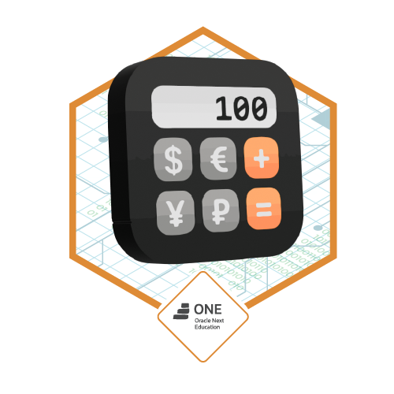

# challenge-one_g6-conversor_de_moneda
---
This project is based on "Conversor de Moneda" challenge proposed by ONE-G6  
How does it look? Take a look at [View Demo](https://youtu.be/-TJ4sduDhZY)

## Stack
- Java
### Third-Party API
- ExchangeRate-API
---
## Software Developer
:copyright: 2024  |  Found a bug or have an idea? [Contact me](https://github.com/javierandres-dev).
